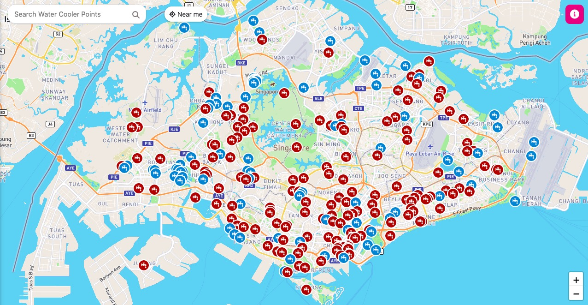

# Water Cooler Map SG

### https://watercoolermap.onrender.com/
## Introduction:
Since coming to live in Singapore, I've noticed some genuinely user-friendly aspects of the city. One prominent example is the abundance of free water Coolers, found in airports, food court corners, near public restrooms, within condom, and especially along parks and greenways. Given Singapore's tropical, equatorial climate, it's easy to get dehydrated when outdoors. Carrying water everywhere can be cumbersome, and buying water can be economically burdensome.

Access to free, safe drinking water outdoors is particularly beneficial for those who enjoy outdoor activities like running or hiking, like myself. However, this raises a question: How do I find these water points when exploring unfamiliar areas?

## Attempted Solutions:
I tried searching on Google Maps and Apple Maps, but to no avail – such data is probably only relevant in Singapore and is a niche need, not covered by these major platforms. Even various Singapore government websites didn't provide the answers I sought.

## My Solution:
I decided to create a map website by using leaflet.js. Upon opening, the website shows nearby water points, giving details like latitude and longitude, the floor(storey), and whether the water is room temperature, cold, or hot. It also displays a picture of the area and easily integrates with third-party map applications for navigation.

Of course, I don't have complete data. Hence, the app includes a feature to "upload a water point", encouraging community participation to gradually enhance the database. The goal is to cover most of the water points in Singapore. Thus, Water Cooler Map SG was born. However, as I'm new to Leaflet, the app may have some minor issues and a basic interface, but I'm committed to improving it.

## [Uploading Water Points:](https://watercoolermap.onrender.com/add)
To upload a water point, click on the top right corner of the map. You'll need to take a photo of the water point and fill in the necessary information and hit "Submit."

## Contact and Inquiries:
For any issues with the app or further queries, contact me via Email(molly6943liu@gmail.com) here. I welcome all inquiries and feedback.